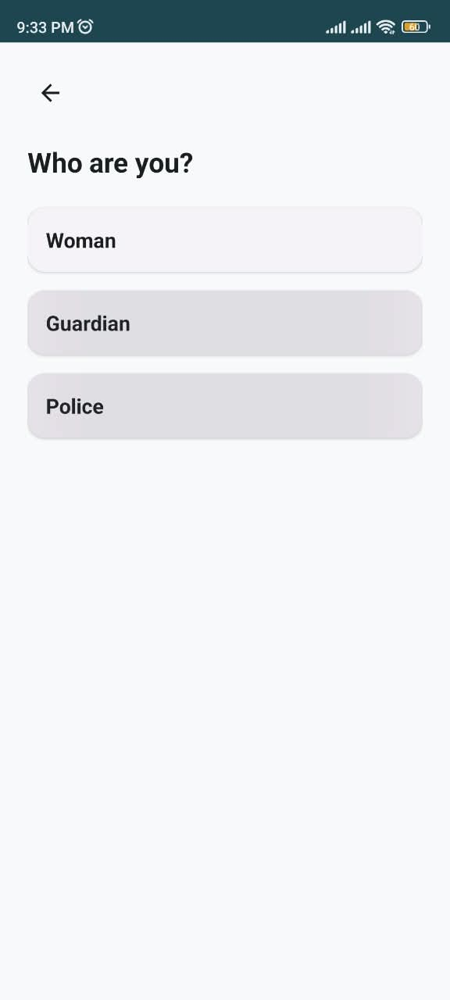
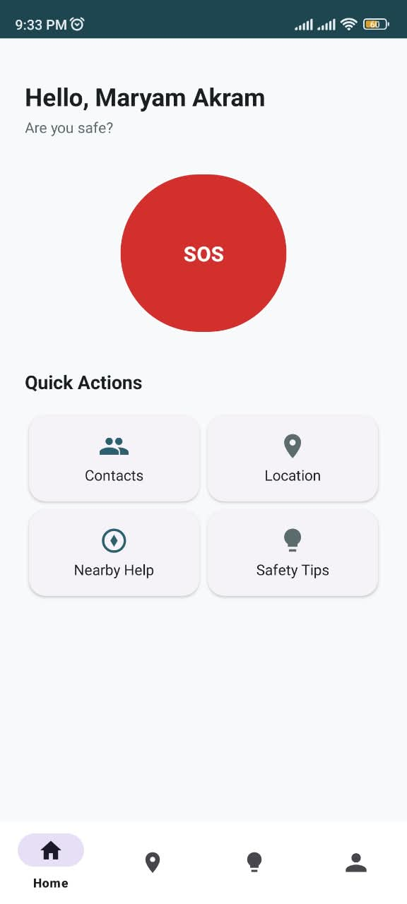
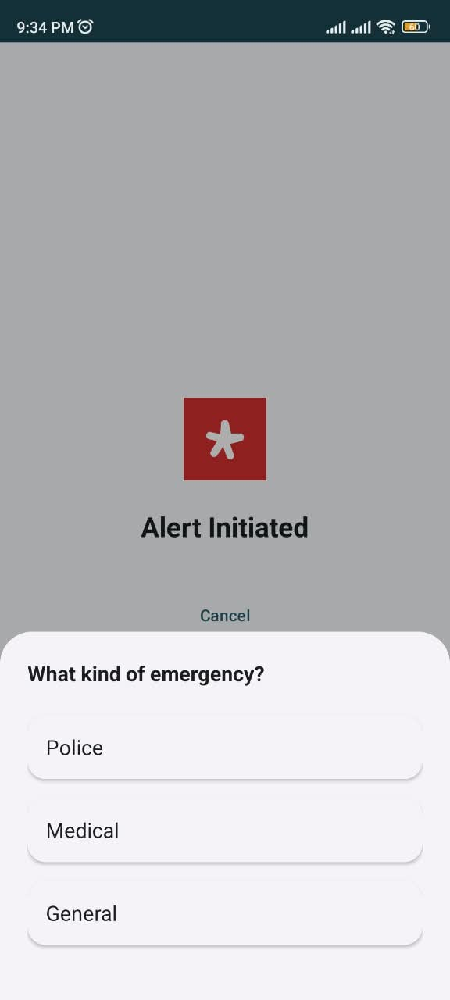
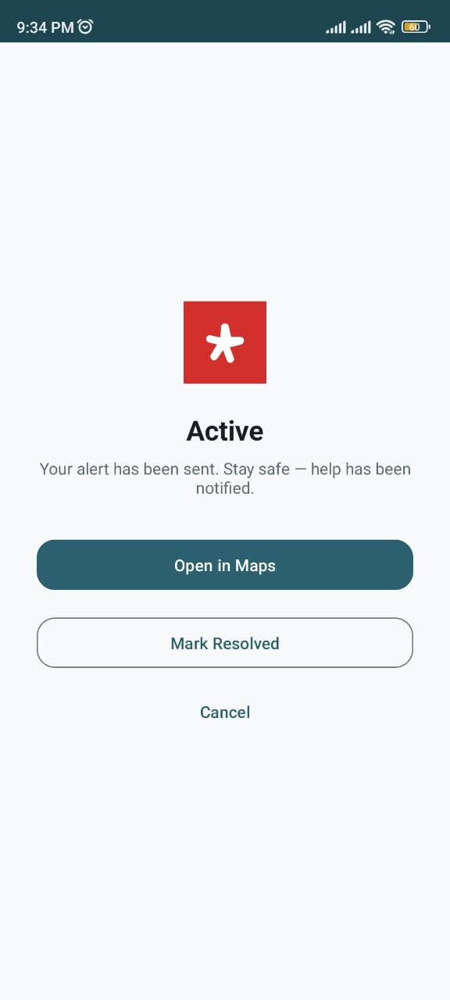
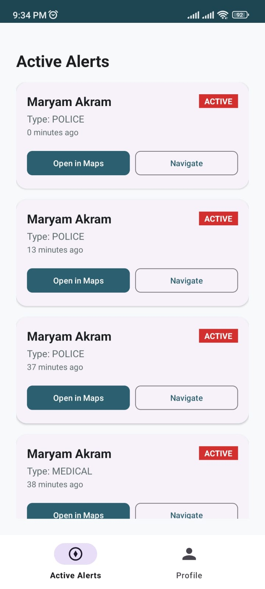
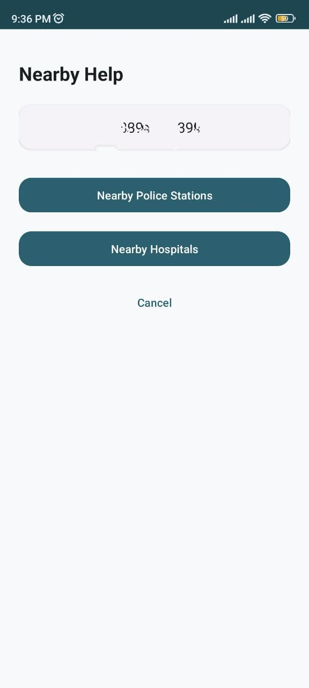

# SafeHer — Women Safety App

A modern Android safety application built with Java and XML Views, following MVVM architecture with a Repository pattern. SafeHer helps women raise emergency alerts, share their live location, and reach trusted contacts, guardians, and police in a single tap.


---

## Overview

SafeHer is a role-based emergency response app supporting three types of users — **Woman**, **Guardian**, and **Police** — connected through a single, unified authentication flow. When a woman triggers an SOS, her live location and emergency type are broadcast in real time to the relevant guardians and, where appropriate, police, using Firebase Realtime Database and Google Maps intents.

## Problem Statement

Personal safety apps are often either overloaded with unnecessary features or too simplistic to be genuinely useful in an emergency. SafeHer focuses on the essentials: get help requested, get a location shared, and get it in front of the right people — fast, and without requiring a paid Maps SDK or complex backend.

## Key Features

- One-tap **SOS** with a confirmation countdown to avoid accidental triggers
- Emergency type selection — **Police**, **Medical**, or **General** — each routed to the appropriate audience
- Real-time location sharing via **Firebase Realtime Database**
- Emergency contacts management (add, call, remove)
- Nearby police station / hospital search via **Google Maps intents** (no API key required)
- Role-based dashboards for Woman, Guardian, and Police
- Full loading / success / error states on every network-dependent action

## User Roles

| Role | Capabilities |
|---|---|
| **Woman** | Trigger SOS, manage emergency contacts, view safety tips, share/view location |
| **Guardian** | View live emergency alerts from linked women, open shared location in Maps |
| **Police** | View police-relevant alerts only (medical-only alerts are excluded), navigate to the location |

## Emergency Flow

1. Woman presses the **SOS** button on her home screen
2. A short countdown gives her the chance to cancel
3. She selects an emergency type: **Police**, **Medical**, or **General**
4. The app acquires her current location via `FusedLocationProviderClient`
5. An alert is written to Firebase Realtime Database with her name, type, coordinates, and timestamp
6. Guardians see the alert immediately; Police see it too **unless it's medical-only**
7. Guardian/Police can open the location directly in Google Maps, or start navigation
8. The alert can be marked **Resolved** once the situation is handled

Every step degrades gracefully — permission denial, disabled GPS, no internet, or a failed database write all show a clear, specific message instead of a blank screen.

## Screenshots

*(Click on any image to view it in full size)*

<div align="center">
  <table>
    <tr>
      <td align="center">
        <br />
        <sub><b>Welcome Screen</b></sub>
      </td>
      <td align="center">
        <br />
        <sub><b>Woman Home</b></sub>
      </td>
      <td align="center">
        <br />
        <sub><b>SOS Flow</b></sub>
      </td>
    </tr>
    <tr>
      <td align="center">
        <br />
        <sub><b>Emergency Active</b></sub>
      </td>
      <td align="center">
        <br />
        <sub><b>Guardian Dashboard</b></sub>
      </td>
      <td align="center">
        <br />
        <sub><b>Nearby Help</b></sub>
      </td>
    </tr>
  </table>
</div>

## Tech Stack

- **Language:** Java
- **UI:** XML Views, ViewBinding, Material Components
- **Architecture:** MVVM + Repository Pattern
- **Auth:** Firebase Authentication (Email/Password)
- **Database:** Firebase Realtime Database
- **Location:** FusedLocationProviderClient (Google Play Services)
- **Maps:** Google Maps via Android intents — no embedded SDK, no API key billing
- **Build:** Gradle, Android Gradle Plugin

## Architecture

```text
UI (Activities / Fragments)
        ↓ observes
ViewModel (LiveData<Resource<T>>)
        ↓ calls
Repository (Firebase / Location APIs)
        ↓
Firebase Realtime Database / FusedLocationProviderClient / Google Maps Intents
Activities and Fragments never talk to Firebase directly — all data operations are routed through a Repository, and all UI state (loading/success/error) flows through a Resource<T> wrapper exposed by the ViewModel.

Project Structure
text
com.example.womansafetyapp
├── data/
│   ├── model/          User, EmergencyContact, EmergencyAlert, UserRole, EmergencyType, EmergencyStatus
│   └── repository/      AuthRepository, UserRepository, ContactRepository, EmergencyRepository
├── location/             SafetyLocationManager (FusedLocationProviderClient wrapper)
├── ui/
│   ├── common/           Splash, Welcome, RoleSelection, Emergency, Location, shared AlertAdapter
│   ├── auth/             AuthActivity (shared login/register flow)
│   ├── woman/             WomanMainActivity + Home/Location/SafetyTips/Profile fragments
│   ├── guardian/          GuardianMainActivity + Home/Profile fragments
│   └── police/            PoliceMainActivity + Home/Profile fragments
├── viewmodel/             AuthViewModel, WomanViewModel, EmergencyViewModel, LocationViewModel,
│                          GuardianViewModel, PoliceViewModel, ProfileViewModel
└── utils/                 Constants, Resource, SessionManager, MapsIntentHelper
Firebase Usage
Only Authentication and Realtime Database are used — no Firestore, Storage, or Cloud Functions, keeping the project entirely on Firebase's free Spark plan.

text
users/{userId}
  ├── name, email, phone, role

emergencyContacts/{womanId}/{contactId}
  ├── name, phone, relationship

emergencyAlerts/{alertId}
  ├── womanId, womanName, type, latitude, longitude, timestamp, status
Realtime Database security rules restrict all reads/writes to authenticated users, and a woman's own alerts/contacts can only be written by her own account.

Location & Maps Approach
Location is fetched on demand via FusedLocationProviderClient.getCurrentLocation() — there's no continuous background tracking, keeping the app's permission footprint and battery impact minimal. Google Maps is opened through plain geo: and google.navigation: intents, so the project needs no Maps SDK dependency and no billing-enabled API key for its core functionality.

Setup Instructions
Clone the repository and open it in Android Studio.

Create a free Firebase project.

Add an Android app with package name com.example.womansafetyapp, download the generated google-services.json, and place it in the app/ folder.

In the Firebase Console, enable:

Authentication → Sign-in method → Email/Password

Realtime Database (start in locked mode), then paste the rules from database.rules.json into the Rules tab and publish.

Sync Gradle and run.

Permissions
Permission	Reason
ACCESS_FINE_LOCATION / ACCESS_COARSE_LOCATION	Required to attach an accurate location to an SOS alert
INTERNET / ACCESS_NETWORK_STATE	Required for Firebase Authentication and Realtime Database
No CALL_PHONE, SEND_SMS, or notification permissions are requested, since the app doesn't place calls or send SMS directly — calling a contact hands off to the device's own Phone app via an intent.

Testing Scenarios
✅ Woman registers → selects Woman role → SOS → Police type → alert created → visible to both Guardian and Police

✅ Woman → SOS → Medical type → alert visible to Guardian only, not to Police

✅ Invalid login / invalid registration → clear inline error, no crash

✅ Location permission denied → specific error message, retry available

✅ GPS disabled → specific error message

✅ No internet during alert creation → error shown, no silent failure

✅ Logout → session cleared → app restart returns to Welcome, not the dashboard

✅ App restart while logged in → returns directly to the correct role dashboard

Project Evolution
This project began as a university final-year project and was later redesigned and rebuilt from the ground up as a portfolio-oriented Android application — with a new architecture (MVVM + Repository), a new UI system, and a new visual identity, while keeping the same core mission: making it faster and easier for women to get help.

Built by Maryam Akram